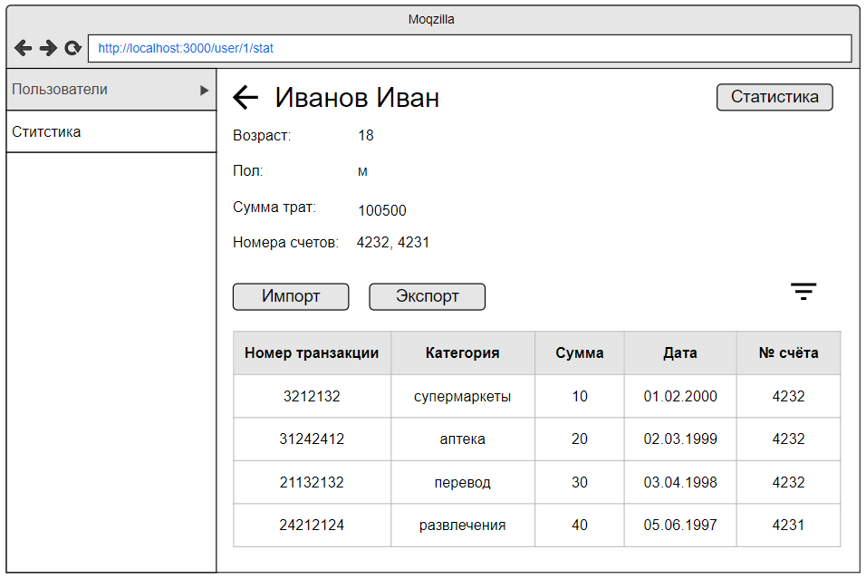
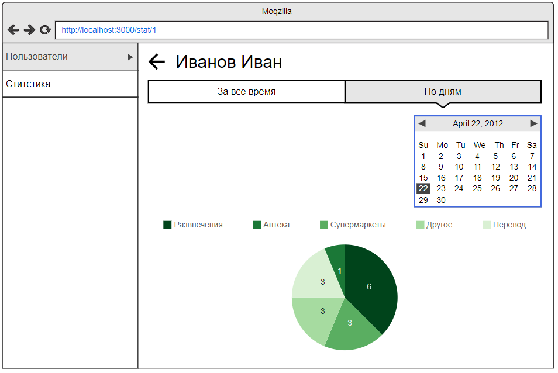

**Use Case**

Список всех пользователей


Профиль пользователя



Фильтрация списка транзакций пользователя


Страница транзакции


Статистика пользователя за все время


Статистика пользователя по дням




**Описание сценариев использования**

Для отображения таблицы всех пользователей в системе:

1.  В главном меню нажать вкладку "Пользователи"

2.  Подождать завершения загрузки таблицы

3.  В результате успешного завершения, на экране пропадет иконка
    загрузки

4.  Если загрузка не завершается длительное время, то попробовать в
    другое время

Для сортировки пользователей по имени:

1.  Навести на заголовок колонки "Пользователь"

2.  Нажатием на появившуюся иконку стрелки изменять тип сортировки
    таблицы по колонке "Пользователь"

3.  Подождать завершения загрузки таблицы

4.  В результате успешного завершения, на экране пропадет иконка
    загрузки

5.  Если загрузка не завершается длительное время, то попробовать в
    другое время

Для сортировки пользователей по потраченной сумме:

1.  Навести на заголовок колонки "Сумма трат"

2.  Нажатием на появившуюся иконку стрелки изменять тип сортировки
    таблицы по колонке "Сумма трат"

3.  Подождать завершения загрузки таблицы

4.  В результате успешного завершения, на экране пропадет иконка
    загрузки

5.  Если загрузка не завершается длительное время, то попробовать в
    другое время

Для перехода на страницу определенного пользователя:

1.  На странице "Пользователи" в таблице всех пользователей навести на
    строку нужного пользователя

2.  Нажать на выбранную строку таблицы

3.  Подождать завершения загрузки страницы

4.  В результате успешного завершения, на экране пропадет иконка
    загрузки

5.  Если загрузка не завершается длительное время, то попробовать в
    другое время

Для фильтрации списка транзакций по дате:

1.  Перейти на страницу нужного пользователя

2.  Рядом со списком транзакций нажать иконку "Фильтр"

3.  Ввести в поле "С" дату с которой надо фильтровать

4.  Ввести в поле "По" дату по которую надо фильтровать

5.  Нажать на кнопку "Применить"

6.  Подождать завершения загрузки таблицы

7.  В результате успешного завершения, на экране пропадет иконка
    загрузки

8.  Если загрузка не завершается длительное время, то попробовать в
    другое время

Для фильтрации списка транзакций по категории:

1.  Перейти на страницу нужного пользователя

2.  Рядом со списком транзакций нажать иконку "Фильтр"

3.  Отметить названия категорий, по которым нужно фильтровать

4.  Нажать на кнопку "Применить"

5.  Подождать завершения загрузки таблицы

6.  В результате успешного завершения, на экране пропадет иконка
    загрузки

7.  Если загрузка не завершается длительное время, то попробовать в
    другое время

Для перехода на страницу транзакции

1.  Перейти на страницу нужного пользователя

2.  В таблице всех транзакций выбрать строку с нужной транзакцией

3.  Нажать на выбранную строку

4.  Подождать завершения загрузки страницы

5.  В результате успешного завершения, на экране пропадет иконка
    загрузки

6.  Если загрузка не завершается длительное время, то попробовать в
    другое время

Для перехода на страницу статистики за все время нужного пользователя

1.  Перейти на странице нужного пользователя

2.  Нажать на кнопку "Статистика"

3.  В меню выбрать пункт "За все время"

4.  Подождать завершения загрузки статистики

5.  В результате успешного завершения, на экране пропадет иконка
    загрузки

6.  Если загрузка не завершается длительное время, то попробовать в
    другое время

Для перехода на страницу статистики по дням нужного пользователя

1.  Перейти на странице нужного пользователя

2.  Нажать на кнопку "Статистика"

3.  В меню выбрать пункт "По дням"

4.  В календаре выбрать необходимую дату

5.  Подождать завершения загрузки статистики

6.  В результате успешного завершения, на экране пропадет иконка
    загрузки

7.  Если загрузка не завершается длительное время, то попробовать в
    другое время

Для перехода на страницу статистики за все время всех пользователей

1.  В главном меню выбрать пункт "Статистика"

2.  В меню выбрать пункт "За все время"

3.  Подождать завершения загрузки статистики

4.  В результате успешного завершения, на экране пропадет иконка
    загрузки

5.  Если загрузка не завершается длительное время, то попробовать в
    другое время

Для перехода на страницу статистики по дате всех пользователей

1.  В главном меню выбрать пункт "Статистика"

2.  В меню выбрать пункт "По дате"

3.  В календаре выбрать необходимую дату

4.  Подождать завершения загрузки статистики

5.  В результате успешного завершения, на экране пропадет иконка
    загрузки

6.  Если загрузка не завершается длительное время, то попробовать в
    другое время

Для массового добавления и получения данных из таблиц сайта необходимо
нажать на кнопки импорт и экспорт соответственно.

Страницы статистики всех пользователей и конкретного пользователя
различаются минимально.

# Data Model

## Модель данных NoSQL


## Описание назначений коллекций, типов данных и сущностей

В качестве СУБД используется Firebase. В ней в виде коллекций документов хранятся данные о пользователях, их счетах и транзакциях

### Описание структуры документов

#### user
* **id** *String*
    Илентификатор пользователя. V = 2b*20 = 40b (Firebase по умолчанию генерирует 20-ти значный id)
* **name** *String*
    Полное имя пользователя. V = 2b*25 = 50b
* **age** *Number*
    Возраст пользователя. V = 2b*20 = 40b
* **sex** *String*
    Пол пользователя. V = 2b*6 = 12b
* **spendings** *Number*
    Общие траты пользователя за всё время. V = 2b*25 = 50b
* **accounts** *String[]*
    Список счетов пользователя. V = 2b\*20\*N = 40b (N количество счетов)
    
#### account
* **id** *String*
    Идентификатор счёта. V = 2b*20 = 40b
* **userId** *String*
    Идентификатор владельца счёта. V = 2b*20 = 40b
* **mony** *Number*
    Объем средств на счету. V = 2b*15 = 40b
* **transactions** *String[]*
    Список всех транзакций, совершенных на этом счету. V = 2b\*20\*N = 40b (N количество транзакций)
    
#### transaction
* **id** *String*
    Идентификатор финансовой транзакций. V = 2b*20 = 40b
* **category** *String*
    Ктегория покупки. V = 2b*10 = 20b
* **userId** *String*
    Идентификатор пользователя, проводившего транзакцию. V = 2b*20 = 40b
* **accountId** *String*
    Номер счёта с которого проводилась транзакция. V = 2b*20 = 40b
* **amount** *Number*
    Размер транзакции. V = 2b*4 = 40b
* **crated** *Date*
    Дата проведения транзакции. V = 8b
    
    
###  "Чистый" объём
user_V = 192b

account_V = 120b 

trnsaction_V = 188b

### Фактический объём
user_V = 192b + 40b\*accounts_N

account_V = 120b + 40b\*transactions_N

trnsaction_V = 188b

### Избыточность 
(user_V\*user_N + account_V\*account_N + transaction_V\*transaction_N) \/
((user_V + 40b\*accounts_N)\*user_N + (account_V+40b\*transactions_N)\*account_N + transaction_V\*transaction_N)

### Направление роста
Основной причиной роста объёма данных БД являются транзакции. При добавлении одной транзакции создаётся новый документ транзакции (268b) плюс добавление новой записи в список транзакций счёта (40b). В итоге 308b на одну запись. При расчёте направления роста можно не учитывать новых пользователей и их счета, т.к  в сравнении с количеством транзакций их вклад не велик

### Запросы
* Запрос на получение списка пользователей
```
firestore.collection('users').get()
```
* Запрос на получение транзакций пользователя, отсортированых по времени
```
firestore.collection('transactions').where('userId', '==', [USER_ID]).orderBy('created', 'desc').get()
```
* Запрос на получение счетов пользователя
```
firestore.collection('accounts').where('userId', '==', [USER_ID]).get()
```
    
## Модель данных SQL


## Описание назначений коллекций, типов данных и сущностей

### Описание структуры документов

#### user
* **id** *varchar* 
    Илентификатор пользователя. V = 2b*20 = 40b
* **name** *varchar*
    Полное имя пользователя. V = 2b*25 = 50b (25 - примерная средняя длина ФИО)
* **age** *int*
    Возраст пользователя. V = 4b
* **sex** *varchar*
    Пол пользователя. V = 2b (ожна буква м/ж)
* **spendings** *int* 
    Общие траты пользователя за всё время. V = 4b
  
    
#### user_accounts
* **userId** *varchar*
    Идентификатор пользователя. V = 2b*20 = 40b
* **accountId** *varchar*
    Идентификатор аккаунта. V = 2b*20 = 40b

#### account
* **id** *varchar*
    Идентификатор счёта. V = 2b*20 = 40b
* **userId** *varchar*
    Идентификатор владельца счёта. V = 2b*20 = 40b
* **mony** *int*
    Объем средств на счету. V = 4b

#### account_transactions
* **accountId** *varchar*
    Идентификатор аккаунта. V = 2b*20 = 40b
* **transactionid** *varchar*
    Идентификатор пользователя. V = 2b*20 = 40b

#### transaction
* **id** *varchar*
    Идентификатор финансовой транзакций. V = 2b*20 = 40b
* **category** *varchar*
    Ктегория покупки. V = 2b*10 = 20b
* **amount** *int*
    Размер транзакции. V = 4b
* **crated** *date*
    Дата проведения транзакции. V = 8b
    
    
###  "Чистый" объём
user_V = 100b
account_V = 84b
transaction_V = 72b

### Фактический объём
user_V = 100b
user_accounts_V = 80b\*accounts_N
account_V = 84b
account_transactions_V = 80b\*transactions_N
transaction_V = 72b

### Избыточность 
(user_V\*user_N + account_V\*account_N + transaction_V\*transaction_N) \/
(user_V\*user_N + 80b\*accounts_N + account_V\*account_N + 80b\*transactions_N + transaction_V\*transaction_N)


### Запросы
* Запрос на получение списка пользователей
```
SELECT * FROM user
```
* Запрос на получение транзакций пользователя, отсортированых по времени
```
SELECT transaction.* 
FROM transactions 
LEFT JOIN account_transactions ON transaction.id = account_transactions.transactionId
LEFT JOIN user_accounts ON user_accounts.accountId = account_transactions.accountId
WHERE user_accounts.userId = [USER_ID]
ORDER BY transaction.created
```
* Запрос на получение счетов пользователя
```
SELECT * 
FROM accounts 
WHERE userId = [USER_ID]
```

##Вывод
Можно сделать следующие выводы
* Для необходимых запросов в SQL необходимо делать дополнительные таблицы связности
* Таблицы свзяности занимают больше места, чем просто массив хранящий идентификаторы,
 т.к массив хранится прямо в документе пользователя 
 ( занимает user_id + transaction_id\*transactions_N ),
 а таблица хранит каждую запись отдельно ( (user_id+transaction_id)*transactions_N )
* Анологичные запросы в SQL являются более громоздкими

